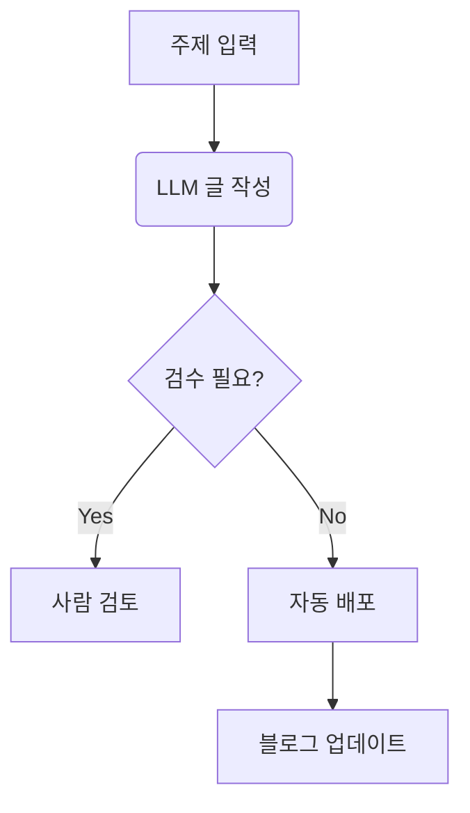

# Automated Blog with MkDocs

# Guideline

MkDocs Material 테마의 강력한 기능(Admonition, Code Block, Tab 등)을 모두 활용한 블로그 작성 방법은 아래 예제 형식을 참고.

---

### 📂 파일 생성: `docs/blog/posts/2024-02-01-first-post.md`

아래 내용을 그대로 복사해서 파일로 저장하세요.

```markdown
---
title: MkDocs Material 기능 완벽 가이드
date: 2024-02-01
authors:
  - '0x68756E61'
categories:
  - Guide
  - MkDocs
tags:
  - markdown
  - demo
  - features
---

# MkDocs Material 기능 샘플

이 글은 **LLM 자동화 블로그** 운영 시 사용할 수 있는 다양한 마크다운 스타일링 예시입니다.
글의 요약(Lead) 부분이 여기에 들어갑니다. 목록 보기에서 미리보기로 노출됩니다.

---

## 1. 텍스트 강조 (Admonitions)

가장 많이 사용되는 기능입니다. `note`, `tip`, `warning`, `danger` 등을 사용할 수 있습니다。

!!! note "참고 사항"
    이것은 일반적인 노트를 작성할 때 사용합니다。
    파란색 박스로 렌더링됩니다。

!!! tip "꿀팁"
    독자에게 팁을 줄 때 사용합니다。 초록색으로 보입니다。

!!! warning "주의"
    경고 메시지입니다。 주황색으로 강조됩니다。

!!! danger "위험 (중요)"
    매우 중요한 내용이나 에러 관련 내용은 이걸 쓰세요。

??? info "눌러서 펼쳐보기 (Collapsible)"
    내용이 너무 길 때 이렇게 접어둘 수 있습니다。
    클릭하면 내용이 나옵니다。

---

## 2. 코드 블록 (Code Blocks)

코드 하이라이팅、 줄 번호、 파일명 표시、 복사 버튼이 자동 지원됩니다。

```python title="automation.py" linenums="1"
import os

def hello_world():
    # 주석 처리된 부분
    print("Hello, MkDocs!")
    
    # 변경 사항 표시 (Diff)
    path = os.getcwd()  # - (삭제된 줄)
    path = "Changed"    # + (추가된 줄)

```

---

## 3. 탭 기능 (Content Tabs)

운영체제별 설치법이나 여러 언어 예제를 보여줄 때 유용합니다。

=== "Python"
`bash pip install mkdocs-material `

=== "Node.js"
`bash npm install mkdocs-material `

=== "Docker"
`bash docker pull squidfunk/mkdocs-material `

---

## 4. 다양한 리스트와 체크박스

* [x] `mkdocs.yml` 설정 완료
* [x] GitHub Actions 연동
* [ ] 자동 글쓰기 스크립트 작성

1. 첫 번째 단계
2. 두 번째 단계
* 하위 단계 A
* 하위 단계 B


---

## 5. 데이터 테이블

| 기능 | 설명 | 비고 |
| --- | --- | --- |
| **Markdown** | 표준 문법 | 기본 |
| **Extensions** | 확장 기능 | 설정 필요 |
| **Plugins** | 파이썬 플러그인 | 설치 필요 |

---

## 6. 특수 서식

* **형광펜 효과**: 텍스트 중 ==중요한 부분==을 하이라이트 합니다。
* **키보드 키**: <kbd>Ctrl</kbd> + <kbd>Alt</kbd> + <kbd>Del</kbd>
* **각주**: 문장 끝에 설명을 답니다.[^1]
* **아이콘**: 이모지 외에도 아이콘을 쓸 수 있습니다。 :smile: :heart:

---

## 7. 다이어그램 (Mermaid)

순서도나 시퀀스 다이어그램을 코드로 그립니다。



```

---

### ⚠️ 필수 설정 (`mkdocs.yml`)

위의 샘플 코드가 예쁘게 렌더링되려면、 **`mkdocs.yml` 파일에 확장 기능(Extensions) 설정이 반드시 되어 있어야 합니다。**

기존 `mkdocs.yml` 내용을 아래 내용으로 업데이트(또는 추가) 해주세요。

```yaml
site_name: 나의 AI 블로그
site_url: https://{username}.github.io/
theme:
  name: material
  features:
    - content.code.copy       # 코드 복사 버튼
    - content.tabs.link       # 탭 링크
    - navigation.expand       # 메뉴 펼치기
  palette: 
    scheme: default           # 다크모드 설정 가능

# 🔥 아래 설정이 있어야 샘플 코드가 정상 작동합니다。
markdown_extensions:
  - admonition                # 박스 강조 기능 (!!! note)
  - pymdownx.details          # 접기/펼치기 (??? info)
  - pymdownx.superfences:     # 탭 안에 코드 블록 넣기, Mermaid 등
      custom_fences:
        - name: mermaid
          class: mermaid
          format: !!python/name:pymdownx.superfences.fence_code_format
  - pymdownx.tabbed:          # 탭 기능 (=== "Tab")
      alternate_style: true 
  - pymdownx.highlight:       # 코드 하이라이팅
      anchor_linenums: true
  - pymdownx.inlinehilite
  - pymdownx.snippets
  - pymdownx.tasklist:        # 체크박스 ([x])
      custom_checkbox: true
  - pymdownx.emoji:           # 이모지 (:smile:)
      emoji_index: !!python/name:materialx.emoji.twemoji
      emoji_generator: !!python/name:materialx.emoji.to_svg
  - pymdownx.mark             # 형광펜 (==text==)
  - pymdownx.keys             # 키보드 키 (<kbd>)
  - footnotes                 # 각주

plugins:
  - search
  - blog:                     # 블로그 기능 활성화
      post_dir: blog

```

### ✅ 적용 방법

1. **`mkdocs.yml` 수정:** 위 설정을 복사해서 붙여넣습니다。
2. **`docs/blog/2024-02-01-first-post.md` 생성:** 샘플 마크다운을 저장합니다。
3. **확인:** `mkdocs serve` 명령어로 로컬에서 열어보시면、 박스、 탭、 차트 등이 화려하게 렌더링 된 것을 보실 수 있습니다。

---

## Posting policy (updated)

- From now on, I will only publish new posts to the blog when you explicitly ask me to. I will not publish or push anything unless you request it.
- Workflow: When you request a post, provide the topic, title, body, and any metadata (authors, categories, tags). I will format the post according to the examples above and place the file in `jekyll_source/_posts/` (or `docs/blog/` if using MkDocs). I will then build the site locally and push the generated static site to the `main` branch so it is served.
- Local path: `/home/ubuntu/sites/0x68756E61.github.io` is the working directory for all blog operations. I will perform builds and commits from there.
- If you want automated posting or scheduling later, tell me and I'll propose a secure workflow.
- The blog's featured image is created using nano-banana-pro skills and attached as an image link to the first line of the post. Refer to the post content to create and apply the most appropriate image creation prompt.
- Blog authors must always be specified as '0x68756E61' to successfully build with MkDocs.

---

Now LLM에게 **"이 샘플 파일의 형식을 참고해서 새 글을 써줘"** 라고 하면、 저는 대표님이 승인하실 때까지 실제 게시를 하지는 않겠습니다。 If you tell me to publish, I'll do the build and push as described.
