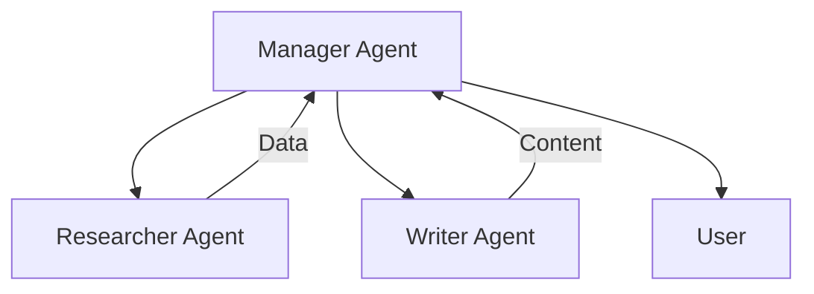

> LEAD: OpenClaw(Clawdbot 기반) 환경에서 멀티 에이전트를 생성하고 구성하는 방법을 설명합니다. 이 가이드는 단일 게이트웨이 내에서 다양한 페르소나와 권한을 가진 에이전트들을 운영하는 핵심 노하우를 담고 있습니다.

<!-- more -->

# OpenClaw Multi-Agent Creation Guide

OpenClaw (Clawdbot 기반) 환경에서 멀티 에이전트를 생성하고 구성하는 방법을 설명합니다.

---

## 1. 개요 (Overview)

OpenClaw의 멀티 에이전트 시스템을 사용하면 단일 게이트웨이 내에서 서로 다른 **성격(Persona)**, **권한(Permissions)**, **작업 공간(Workspace)**을 가진 여러 에이전트를 실행할 수 있습니다.

!!! info "에이전트 활용 예시"
    - **개인 비서**: 모든 권한을 가진 메인 에이전트
    - **가족/동료용**: 제한된 도구만 사용하는 에이전트
    - **공용/테스트용**: 샌드박스(Docker) 내에서만 실행되는 안전한 에이전트

---

## 2. 에이전트 정의 (Defining Agents)

멀티 에이전트는 설정 파일의 `agents.list` 배열에 정의합니다. 각 에이전트는 고유한 `id`를 가집니다.

### 기본 구조 및 모델 설정

```json title="config.json" linenums="1"
{
  "agents": {
    "list": [
      {
        "id": "main",           // 에이전트 고유 ID
        "default": true,        // 기본 에이전트 여부
        "name": "Main Assistant",
        "model": "anthropic/claude-3-5-sonnet-20240620", // 모델 지정
        "workspace": "~/clawd", // 에이전트 전용 작업 공간
        "sandbox": { "mode": "off" }
      },
      {
        "id": "dev_bot",
        "name": "Developer Bot",
        "model": {
            "primary": "openai/gpt-4o",
            "fallbacks": ["openai/gpt-4o-mini"]
        },
        "workspace": "~/clawd-dev"
      }
    ]
  }
}
```

!!! tip
    모델 설정에 대한 더 자세한 내용은 `how-to-set-models.md` 문서를 참고하세요.

---

## 3. 샌드박스 설정 (Sandbox Configuration)

각 에이전트별로 샌드박스(격리 환경) 적용 여부를 설정하여 보안을 강화할 수 있습니다.

- **mode**:
  - `"off"`: 호스트 머신에서 직접 실행 (높은 권한, 메인 에이전트용)
  - `"all"`: 항상 Docker 컨테이너 내에서 실행 (안전함)
  - `"non-main"`: 메인 세션이 아닐 경우에만 샌드박스 적용 (기본값)
- **scope**:
  - `"agent"`: 해당 에이전트 전용 컨테이너 생성 (데이터 격리)
  - `"session"`: 세션마다 새로운 컨테이너 생성 (휘발성)
  - `"shared"`: 여러 에이전트가 동일한 샌드박스 공유

```json title="sandbox settings"
"sandbox": {
  "mode": "all",
  "scope": "agent"
}
```

---

## 4. 도구 권한 제어 (Tool Restrictions)

에이전트가 사용할 수 있는 도구(Tool)를 제한하여 역할을 명확히 할 수 있습니다.

=== "읽기 전용 에이전트"
    ```json
    "tools": {
      "allow": ["read", "memory_search"],
      "deny": ["write", "edit", "exec", "browser"]
    }
    ```

=== "메시징 전용 에이전트"
    ```json
    "tools": {
      "profile": "messaging",
      "allow": ["slack", "telegram"]
    }
    ```

---

## 5. 전체 설정 예시 (Full Example)

다음은 '메인 에이전트'와 '보안 리서치 에이전트'를 함께 운영하는 설정 예시입니다.

!!! example "복합 구성 사례"
    ```json title="multi-agent-config.json"
    {
      "agents": {
        "defaults": {
          "sandbox": { "mode": "non-main" }
        },
        "list": [
          {
            "id": "master",
            "default": true,
            "name": "Master Control",
            "workspace": "~/openclaw-master",
            "sandbox": { "mode": "off" }
          },
          {
            "id": "researcher",
            "name": "Safe Researcher",
            "workspace": "~/openclaw-research",
            "sandbox": {
              "mode": "all",
              "scope": "agent"
            },
            "tools": {
              "allow": ["read", "web_search", "browser", "memory_search"],
              "deny": ["exec", "write", "gateway"]
            }
          }
        ]
      }
    }
    ```

---

## 6. 적용 및 확인

설정 변경 후 OpenClaw 게이트웨이를 재시작하거나 설정을 적용해야 합니다.

1.  **설정 적용**: `clawdbot gateway config.apply`
2.  **에이전트 목록 확인**: `clawdbot agents list`
3.  **샌드박스 상태 확인**: `clawdbot sandbox status`

---

# OpenClaw Multi-Agent Channel Bindings

OpenClaw (Clawdbot) 환경에서 각 에이전트와 외부 채널(Telegram, Slack, WhatsApp 등)을 연결하는 방법을 설명합니다.

---

## 1. 바인딩(Bindings) 개요

OpenClaw에서 바인딩은 "누가 어디서 말을 걸었을 때, 어떤 에이전트가 응답할지"를 결정하는 규칙입니다.

```json title="binding basic"
{
  "bindings": [
    {
      "agentId": "support",  // 연결할 에이전트 ID
      "match": {
        "provider": "telegram", // 채널 플러그인 이름
        "peer": {
          "id": "123456789"     // 사용자 또는 그룹 ID
        }
      }
    }
  ]
}
```

---

## 2. 매칭 규칙 (Match Rules)

`match` 객체는 들어오는 메시지의 메타데이터와 대조하여 에이전트를 선택합니다.

- **provider**: (필수) 메시지 제공자 (`telegram`, `slack`, `whatsapp`, `discord` 등)
- **accountId**: (옵션) 봇 계정 ID
- **peer**: (옵션) 상대방(유저/그룹) 정보

!!! note "와일드카드(*) 사용"
    `*`를 사용하여 모든 경우를 매칭할 수 있습니다.
    ```json
    "match": {
      "provider": "slack",
      "peer": {
        "kind": "group",
        "id": "*" // 모든 슬랙 그룹 채널
      }
    }
    ```

---

## 3. 채널별 설정 예시

=== "Telegram"
    ```json
    {
      "agentId": "news_bot",
      "match": {
        "provider": "telegram",
        "peer": { "kind": "group", "id": "-1001234567890" }
      }
    }
    ```

=== "WhatsApp"
    ```json
    {
      "agentId": "secretary",
      "match": {
        "provider": "whatsapp",
        "peer": { "kind": "user", "id": "821012345678@s.whatsapp.net" }
      }
    }
    ```

=== "Slack"
    ```json
    {
      "agentId": "notice_bot",
      "match": {
        "provider": "slack",
        "peer": { "id": "C012345ABCD" }
      }
    }
    ```

---

## 4. 우선순위 (Priority)

바인딩은 **위에서 아래로** 순차적으로 검사됩니다.

!!! warning "설정 순서 주의"
    구체적인 규칙을 위에, 일반적인 규칙(와일드카드)을 아래에 배치해야 합니다.

---

## 5. 설정 확인 및 디버깅

1.  **현재 바인딩 목록 확인**:
    ```bash
    clawdbot agents list --bindings
    ```
2.  **로그 모니터링**:
    ```bash
    tail -f ~/.clawdbot/logs/gateway.log | grep "routing"
    ```

---

# OpenClaw Multi-Agent LLM Model Configuration

에이전트별로 사용할 LLM 모델을 설정하여 비용과 성능을 최적화하는 방법을 다룹니다.

---

## 1. 모델 설정 방식

=== "Simple (String)"
    ```json
    "model": "anthropic/claude-3-5-sonnet-20240620"
    ```

=== "Advanced (Object)"
    ```json
    "model": {
      "primary": "openai/gpt-4o",
      "fallbacks": ["anthropic/claude-3-haiku-20240307"]
    }
    ```

---

## 2. 설정 레벨 및 우선순위

1.  **Global Default** (`agents.defaults.model`)
2.  **Agent Specific** (`agents.list[].model`)
3.  **Session Specific** (런타임 동적 변경)

---

# OpenClaw Multi-Agent Cooperation Guide

여러 에이전트가 서로 메시지를 주고받으며 협업하는 방법을 설명합니다.

---

## 1. 세션 전송 (Sessions Send)

에이전트 간 소통의 핵심은 `sessions_send` 도구입니다.

```json title="sessions_send example"
{
  "tool": "sessions_send",
  "arguments": {
    "agentId": "researcher",
    "message": "최근 AI 트렌드에 대해 조사해서 요약해줘."
  }
}
```

---

## 2. 서브 에이전트 생성 (Sessions Spawn)

일회성 작업을 위해 임시 에이전트를 생성합니다.

```json title="sessions_spawn example"
{
  "tool": "sessions_spawn",
  "arguments": {
    "task": "이 웹사이트 분석해줘.",
    "model": "openai/gpt-4o"
  }
}
```

---

## 3. 협업 패턴



---

# OpenClaw Multi-Agent Examples

## Scenario 1: 뉴스 브리핑 팀
`Briefing Master`가 `News Hunter`에게 조사를 시키고 결과를 요약합니다.

## Scenario 2: 안전한 코딩 비서
`Dev Lead`가 위험한 코드를 `Sandbox Runner`(Docker)에게 실행시킵니다.

## Scenario 3: 고객 지원 라우팅
`Triage Bot`이 문의 내용에 따라 `Tech` 또는 `Billing` 팀으로 문의를 분류합니다.

---

!!! note "참고"
    *OpenClaw Documentation v1.0*
